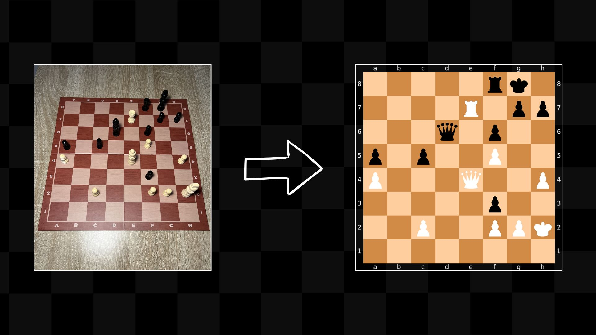

# Projet AM1 - Deep Learning - YOCO

### YOCO - You Only Chess Once
Système de reconnaissance et d'analyse de positions d'échecs par vision par ordinateur.



**Détails techniques:**
- Prétraitement: Algorithme SLID pour la détection de lignes, Bentley-Ottmann pour les intersections
- Architecture CNN: 5 couches convolutives (16, 32, 64, 64, 64 filtres)
- Classification: 13 classes (6 types de pièces x 2 couleurs + cases vides)
- Dataset: 670 images de mon echiquier prise en photo
- Output: Notation FEN (Forsyth-Edwards Notation)

**Dataset et modèle:**
- Dataset HuggingFace: https://huggingface.co/datasets/nathbns/chess-yoco **(FAITE FROM SCRATCH, 128 téléchargement sur HF et en trending dans la catégorie 'image classification'!! 🤗)**


- Modèle HuggingFace: https://huggingface.co/spaces/nathbns/yoco_first_version
- Visualisation du prétraitement: https://huggingface.co/spaces/nathbns/preprocess_yoco

**Documentation complète:** Voir `model_yoco/README.md`

### YOLOv1 - You Only Look Once (Version 1)
Implémentation from scratch de l'architecture YOLOv1 basée sur l'article original de Redmon et al. (2016).

**Détails techniques:**
- Architecture: Réseau convolutif avec 24 couches convolutives + 2 couches fully connected
- Dataset: PASCAL VOC (téléchargé via Kaggle)
- Entraînement: 3 heures sur GPU A100 (Google Colab)
- Article de référence: https://arxiv.org/pdf/1506.02640

**Essayer le modèle:**
- HuggingFace Space: https://huggingface.co/spaces/nathbns/yolo1_from_scratch
- Application web: https://yoco-ochre.vercel.app

### YOLOv3 - You Only Look Once (Version 3)
Deuxième itération avec l'architecture YOLOv3 améliorée.

**Note:** Code en cours de finalisation.

## Application Web

Interface web développée avec Next.js pour tester les différents modèles.

### Installation
Prérequis: Installer Bun (gestionnaire de paquets)

```bash
cd webapp && bun i
```

### Lancement
```bash
bun run dev
```

## Organisation des dossiers

```
.
├── model_yoco/          # Système YOCO de reconnaissance d'échecs
├── yolov1_from_scratch/ # Implémentation YOLOv1
├── yolov3_from_scratch/ # Implémentation YOLOv3
└── webapp/              # Application web Next.js
```

## Répartition du temps de travail

Distribution du temps consacré à chaque composant du projet :

```
YOCO - Chess Recognition     ████████████████████████████ 45%

YOLOv1 Implementation        ████████████████ 25%

Application Web              ████████ 20%

YOLOv3 Implementation        ██████ 10%
```

**Temps total estimé:** ~2-3 Heure par jours


## **A prendre en compte**
- Les modèles YOLO et le modèle YOCO sont héberger sur huggingFace dans la version **gratuite** de l'Hub, ce qui veut dire que les modèles qui n'ont pas eu d'inférence récement ce mettrons en veille (si aucune activité au bout de 48h). S'il sont en veille il seront plus long, faire un appel au modèle le re-active, mais nécéssite plus de temps.
- Je conseille donc de verifier sur mon espace huggingface (https://huggingface.co/datasets/nathbns) si les modèles sont bien en "Running" lors des tests.

## Références académiques

- Redmon, J., Divvala, S., Girshick, R., & Farhadi, A. (2016). "You only look once: Unified, real-time object detection." CVPR.
- D'autre à rajouter.

## Auteur
Nathan BEN SOUSSAN \
Mehdi MOUJIB
